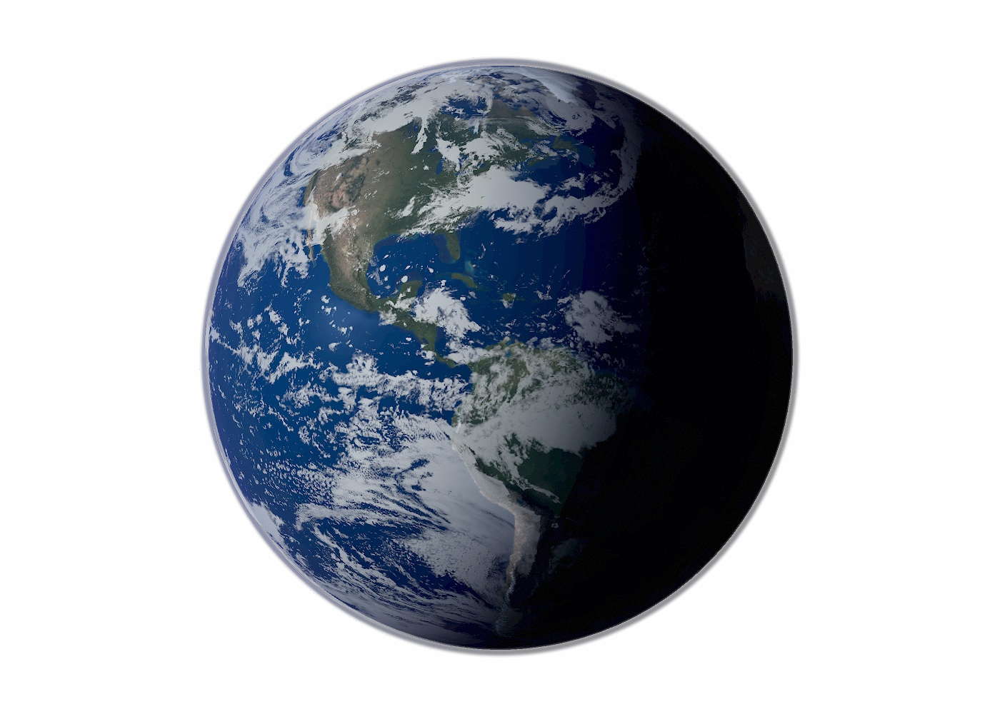

# Earth Three.js

一个独立的 Three.js 地球渲染项目，目标是提供一个可直接嵌入产品首页的高质感地球视觉：高清地表、云层、暗面压黑、黑色轮廓、蓝色大气层、外围背景光、旋转动画和中文调参台。

这个项目起源于 [bigmodel.io](https://bigmodel.io/) 页面中的地球组件。为了让这个视觉组件可以被更多人直接使用、调试、二次创作和持续改进，我把它抽离成了独立的开源项目 `earth-threejs`。欢迎一起使用、提出问题、提交改进，或者基于它做出新的地球视觉效果。



## 在线预览

- 展示页：[https://funengzhe.github.io/earth-threejs/](https://funengzhe.github.io/earth-threejs/)
- 调参页：[https://funengzhe.github.io/earth-threejs/tuning.html](https://funengzhe.github.io/earth-threejs/tuning.html)

GitHub Pages 通过 `.github/workflows/pages.yml` 自动部署。推送到 `main` 后，Actions 会把 `index.html`、`tuning.html`、`earth-three.js`、`assets/` 和 `vendor/` 发布到 Pages。

如果是首次开启 Pages，需要先在 GitHub 仓库里进入 `Settings -> Pages`，将 `Build and deployment` 的 `Source` 设为 `GitHub Actions`。开启后重新运行 `Deploy GitHub Pages` workflow，或再推送一次 `main`，展示页就会发布到上面的地址。

## 页面

- `index.html`：干净展示页，只显示地球，适合截图、嵌入预览或作为最终 demo。
- `tuning.html`：中文调参页，保留实时滑杆、复制参数链接、浅色背景切换和恢复默认。

本地启动：

```bash
python3 -m http.server 4173
```

打开：

```text
http://127.0.0.1:4173/
http://127.0.0.1:4173/tuning.html
```

## 常用参数

两个页面都支持通过 URL 参数覆盖默认效果。

```text
?bg=light
?freeze=1
?quality=low
?quality=balanced
?quality=high
?stars=1
```

说明：

- `bg=light`：浅色背景，用来测试白底页面里的轮廓和外围白光。
- `freeze=1`：静止地球，适合截图或对比参数。
- `quality=low|balanced|high`：性能档位。展示页默认 `balanced`，调参页默认 `high`。
- `stars=1`：打开轻量星点背景，默认关闭，方便干净嵌入。

调参参数会由 `tuning.html` 自动生成，例如：

```text
?atmosphereColor=%232a45b2&darkStrength=0.680&rotationSpeed=0.000036
```

## JS 调用

```html
<div class="orb" data-earth-globe>
  <canvas data-earth-canvas></canvas>
</div>

<script type="module">
  import { createHeroEarth } from "./earth-three.js";

  const controller = await createHeroEarth({
    globe: document.querySelector("[data-earth-globe]"),
    canvas: document.querySelector("[data-earth-canvas]"),
    quality: "balanced",
    showStars: false,
    settings: {
      darkStrength: 0.68,
      atmosphereColor: "#2a45b2",
    },
  });

  controller?.setTuning({ rotationSpeed: 0.00006 });
</script>
```

返回的 `controller`：

- `resize()`：外层容器尺寸变化时手动触发重绘。默认已内置 `ResizeObserver`。
- `getTuning()`：读取当前参数。
- `setTuning(nextSettings)`：实时更新光照、云层、大气层、暗面和旋转速度。
- `setVisible(true|false)`：外部页面想主动暂停或恢复时使用。
- `dispose()`：移除页面或组件卸载时释放 WebGL 资源。

## 默认视觉参数

默认参数在 [earth-three.js](./earth-three.js) 的 `EARTH_TUNING_PRESET` 中维护。调参页复制出来的 URL 参数确认后，可以同步回这里作为新的默认效果。

当前默认值来自最后一版确认参数：

```js
{
  atmosphereColor: "#2a45b2",
  atmosphereShellSize: 1.004,
  atmosphereShellStrength: 0.33,
  backgroundHaloSize: 1,
  backgroundHaloStrength: 0.1,
  blackRimStrength: 0.35,
  cameraZ: 5.45,
  cloudContrast: 1,
  cloudOpacity: 1,
  darkStrength: 0.68,
  innerAtmosphereSize: 1,
  innerAtmosphereStrength: 0.34,
  lightIntensity: 0.76,
  lightX: -0.72,
  lightY: 0.2,
  lightZ: 0.38,
  nightLightStrength: 0.012,
  outerAtmosphereSize: 1.007,
  outerAtmosphereStrength: 0.06,
  rotationSpeed: 0.000036,
}
```

## 性能优化

项目已经内置几项运行时优化：

- 展示页默认使用 `balanced` 质量，降低 DPR、球体分段、MSAA 和纹理各向异性压力。
- 调参页默认使用 `high` 质量，方便精细对比最终视觉。
- 页面隐藏时自动暂停 `requestAnimationFrame`。
- 地球离开视口时自动暂停渲染。
- `rotationSpeed=0` 或 `freeze=1` 时只渲染静态帧，不持续跑动画循环。
- 使用 `ResizeObserver` 监听容器尺寸，避免不必要的全局重算。

详细说明见 [docs/performance.md](./docs/performance.md)。

## 项目结构

```text
.
├── index.html
├── tuning.html
├── earth-three.js
├── docs/
│   ├── agent-usage.md
│   ├── performance.md
│   └── tuning.md
├── assets/
│   ├── favicon.svg
│   └── earth/
└── vendor/
    └── three.module.js
```

## 检查

```bash
node --check earth-three.js
```

如果本机有 npm，也可以使用：

```bash
npm run check
```

## 文档

- [调试文档](./docs/tuning.md)
- [性能文档](./docs/performance.md)
- [Agent 调用说明](./docs/agent-usage.md)

## 资源和许可

项目代码使用 MIT License。第三方地球贴图和辅助资源保留原始许可说明：

- [assets/earth/earth-webgl-LICENSE.txt](./assets/earth/earth-webgl-LICENSE.txt)
- [assets/earth/react-earth-lite/LICENSE.txt](./assets/earth/react-earth-lite/LICENSE.txt)

Three.js 运行文件已 vendored 到 `vendor/three.module.js`，因此本地预览不需要安装 npm 依赖。
